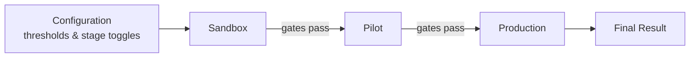

# BigFix Patch Orchestrator — Frontend

A **React 19 + Vite** dashboard for orchestrating OS patch rollouts with **HCL BigFix**.
It walks operators through a **Sandbox → Pilot → Production** promotion flow, surfaces real-time
health/success **KPIs**, and enforces promotion **gates** (success threshold + allowable critical
health failures) — including optional **ServiceNow** Change Request validation before Pilot.

This repository is the **frontend only**. In production it is built to static assets and served by
the PatchSetu backend, which it talks to over the same origin.

---

## Table of contents

- [Tech stack](#tech-stack)
- [Prerequisites](#prerequisites)
- [Quick start](#quick-start)
- [Configuration](#configuration)
- [Available scripts](#available-scripts)
- [Project structure](#project-structure)
- [How it works](#how-it-works)
- [Features](#features)
- [Building & deployment](#building--deployment)
- [Troubleshooting](#troubleshooting)

---

## Tech stack

| Area | Choice |
| --- | --- |
| UI framework | React `19.2` (functional components + hooks) |
| Build tool | Vite `6` (`@vitejs/plugin-react`) |
| Dev HTTPS | `@vitejs/plugin-basic-ssl` (self-signed cert) |
| HTTP client | `axios` `1.15` (`withCredentials`, HTTP-only cookie sessions) |
| Charts | `recharts` `3` |
| PDF export | `jspdf` + `jspdf-autotable` |
| Types/props | `prop-types` |
| Lint | ESLint `10` (`eslint-plugin-react-hooks`, `react-refresh`) |

No CSS framework — styling is plain CSS under `src/styles/`.

---

## Prerequisites

- **Node.js ≥ 18** (required by Vite 6 / React 19) and npm.
- A running **PatchSetu backend** (defaults to `https://localhost:5174`). The frontend is a thin
  client; nearly every view calls the backend `/api/*` routes and relies on its session cookie.

---

## Quick start

```bash
# 1. install dependencies
npm install

# 2. start the dev server (HTTPS, with a self-signed cert)
npm run dev
```

The dev server runs over **HTTPS** (Vite default `https://localhost:5173`). Because the certificate
is self-signed, your browser will show a one-time security warning — accept it to continue.

During development, Vite **proxies** `/api` and `/env.js` to the backend at `https://localhost:5174`
(see [Configuration](#configuration)), so start the backend first.

---

## Configuration

The frontend has **no build-time `.env`**. The API base URL is provided at **runtime** by a small
script the backend serves:

```js
// public/env.js
window.env = {
  VITE_API_BASE: window.location.origin
};
```

- **Production:** the backend serves the built app and its own `env.js`, so `VITE_API_BASE` resolves
  to the **same origin** the app is loaded from — no configuration needed.
- **Development:** `vite.config.js` proxies backend calls so the browser never hits a mixed-content
  or CORS wall:

  ```js
  server: {
    https: true,                 // self-signed via basic-ssl
    proxy: {
      '/api':    { target: 'https://localhost:5174', changeOrigin: true, secure: false },
      '/env.js': { target: 'https://localhost:5174', changeOrigin: true, secure: false },
    },
  }
  ```

- **Fallback:** where code reads the base directly it falls back to `http://localhost:5174`
  (e.g. `src/api/api.js`, `src/App.jsx`).

If your backend runs on a different host/port, update the `proxy.target` values in `vite.config.js`.

---

## Available scripts

| Script | What it does |
| --- | --- |
| `npm run dev` | Start the Vite dev server (HTTPS + API proxy). |
| `npm run build` | Produce a production build in `dist/`. |
| `npm run preview` | Serve the built `dist/` locally for a smoke test. |
| `npm run lint` | Run ESLint across the project. |

---

## Project structure

```
frontend/
├── index.html                 # App HTML shell (loads /env.js then the bundle)
├── vite.config.js             # HTTPS dev server + /api & /env.js proxy
├── eslint.config.js
├── public/
│   └── env.js                 # Runtime config: window.env.VITE_API_BASE
└── src/
    ├── main.jsx               # React entry point
    ├── App.jsx                # App shell, view routing, EnvironmentProvider, lazy-loaded views
    ├── api/
    │   └── api.js             # Preconfigured axios instance (baseURL /api, withCredentials)
    ├── hooks/
    │   └── useTeamState.js    # Pulls the synchronized orchestration state from the backend
    ├── components/
    │   ├── Configuration.jsx      # Orchestration config (thresholds, stage toggles, options)
    │   ├── Environment.jsx        # Environment context/provider (selected baselines + groups)
    │   ├── DecisionEngine.jsx     # Generic gate evaluation + trigger
    │   ├── KpiDetails.jsx         # KPI drill-down (Critical Health / Pending Reboots) + export
    │   ├── Management.jsx         # Environment settings (BigFix/Sandbox/Pilot/Prod, SMTP, etc.)
    │   ├── UserManagement.jsx     # Users: add (local/AD), change role, reset password
    │   ├── RoleManagement.jsx     # BigFix roles: operators, sites, computer assignments
    │   ├── GroupManager.jsx       # Computer group management
    │   ├── PatchCalendar.jsx      # Patch schedule calendar
    │   ├── SnapshotSelector.jsx   # Take VM snapshot (vCenter/Prism)
    │   ├── CloneSelector.jsx      # Clone VM
    │   ├── ComputerList.jsx, FilterDrawer.jsx, FlowCard.jsx,
    │   ├── ReportNotification.jsx, ValidationGate.jsx
    │   ├── auth/
    │   │   └── Login.jsx          # Login (local / LDAP-AD / SAML-Okta aware)
    │   ├── common/                # ConfirmModal, CustomToast, FancySelect,
    │   │                          # InlineSpinner, Paginator, SidePanel
    │   └── pilot/
    │       ├── PilotKPI.jsx           # KPI tiles (Success Rate, Critical Health, Reboot Pending)
    │       ├── PilotEnvironment.jsx   # Baseline → Group deployments + thresholds + patch window
    │       ├── PilotDecisionEngine.jsx# Gate evaluation, CHG modal, trigger logic, stage lock
    │       ├── PilotSandboxResult.jsx # Previous-stage results table + drill-down
    │       └── PilotReports.jsx       # Stage reporting
    ├── modules/
    │   └── risk/                  # Risk Prioritization module
    │       ├── RiskModule.jsx, BaselineTab.jsx, DashboardTab.jsx, PatchTab.jsx
    │       └── dashboard_component/  # Baseline / CVE / Computer / Patch / Overview dashboards
    ├── utils/
    │   ├── descriptionParser.js   # Parse BigFix baseline/action descriptions
    │   ├── errorHandler.js
    │   ├── exportUtils.js         # CSV / PDF export helpers
    │   └── filterUtils.js
    └── styles/                    # Style.css, modal.css, toast.css
```

Heavy views are **code-split** with `React.lazy`, so the initial bundle stays small and each
dashboard loads on demand.

---

## How it works

### Orchestration flow



Each stage has an **Environment & Baseline** panel (one or more *Baseline → Group* deployments),
a **KPI** panel, and a **Decision Engine** that only enables promotion when the gates are met.
Sandbox and Pilot can be toggled on/off in Configuration; when a stage is disabled the flow skips it.

### State & session

- **Session:** authentication uses an **HTTP-only cookie**; `axios` is configured with
  `withCredentials: true` so the cookie rides along automatically.
- **Role context:** the active role is kept in `sessionStorage` (`user_role`) and sent as an
  `x-user-role` header. RBAC is enforced server-side; the UI reflects it.
- **Shared orchestration state:** `useTeamState` fetches the synchronized stage state from
  `/api/auth/team-state`, so what one operator does is visible to the team.

### KPIs & health

KPI tiles per stage show **Success Rate**, **Critical Health Failures**, and **Reboot Pending**,
with drill-down detail pages (columns, export, and per-host actions such as *Restart Service*).
Health rows are flagged by the backend from BigFix session relevance and configurable thresholds
(minimum disk space, last-report age, service status, etc.), scoped to the selected group(s).

---

## Features

- **Guided promotion** — Sandbox → Pilot → Production with per-stage baselines, target groups, and
  configurable gates (success threshold, allowable critical health failures, patch window).
- **Real-time KPIs** — Success Rate, Critical Health Failures, Reboot Pending; interactive
  charts (recharts) and drill-down detail views.
- **Decision Engine** — evaluate against thresholds, optionally raise/validate a **ServiceNow**
  Change Request, and unlock *Trigger* only when gates pass.
- **Risk Prioritization** — CVE, baseline, patch, and computer dashboards.
- **Infrastructure actions** — computer **Group Management**, **Take Snapshot**, and **Clone VM**
  (vCenter / Nutanix Prism via the backend).
- **Administration** — **User Management** (local + Active Directory users, role changes, password
  reset), **Role Management** (BigFix roles: operators, sites, computer assignments), and
  environment **Configuration**.
- **Patch Calendar**, deployment history, and email report notifications.
- **Auth** — local accounts, **LDAP/Active Directory**, and **SAML/Okta**, with in-app role switching.
- **Exports** — CSV and PDF (jspdf) from detail tables.

---

## Building & deployment

```bash
npm run build      # outputs static assets to dist/
```

In production the **backend serves `dist/`** (and its own `env.js`) over HTTPS, so the app and the
API share one origin. Typical flow:

1. `npm run build` on the frontend.
2. Hand `dist/` to the backend's static-hosting step (or its packaging pipeline).
3. Access the app at the backend URL (e.g. `https://<host>:5174`).

Because the app resolves its API base to `window.location.origin`, no rebuild is needed when the
deployment host changes.

---

## Troubleshooting

- **Browser warns the site is "Not secure" / cert error (dev):** expected — `basic-ssl` uses a
  self-signed certificate. Accept the warning once.
- **API calls fail in dev (`Failed to fetch`, CORS, or mixed content):** make sure the **backend is
  running** at the `proxy.target` in `vite.config.js` (`https://localhost:5174` by default), and
  that you're loading the app over the Vite HTTPS URL, not `http://`.
- **Options/dropdowns intermittently empty or slow:** the backend proxies these from BigFix; brief
  `5xx`/latency there is usually a BigFix load issue, not the UI.
- **Blank screen after deploy:** confirm the backend is serving `/env.js` — the app reads
  `window.env.VITE_API_BASE` from it at startup.

---

*This project is the frontend for the BigFix Patch Orchestrator. The backend (API, BigFix/ServiceNow/
vCenter integrations, auth, and DB) lives in a separate repository.*